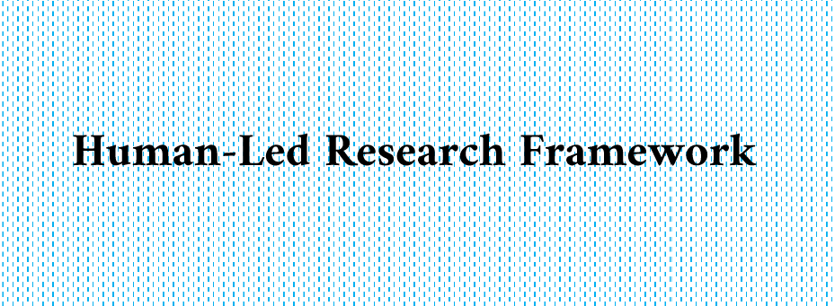

<p align="center">
  
</p>

<h3 align="center">Une méthode réutilisable pour une recherche assistée par IA</h3>

<p align="center">
  Le HLRF est un cadre scientifique et opérationnel destiné aux personnes qui utilisent l'IA générative dans leurs activités de recherche tout en préservant leur propriété intellectuelle, leurs compétences, la vérification et leur responsabilité.
</p>

<p align="center"><a href="README.md">🇬🇧 English</a></p>

<p align="center">
  
  
  
  
  
</p>

<p align="center">
  Il s'adresse aux doctorants, postdoctorants, enseignants-chercheurs, professeurs, ingénieurs de recherche, étudiants et autres professionnels de la recherche. Ce n'est ni un agent IA, ni un superviseur, ni un substitut à une méthode de recherche.
</p>

## Présentation

Le HLRF est un cadre scientifique et opérationnel destiné aux chercheurs et professionnels de la recherche qui utilisent l'IA générative tout en préservant leur propriété intellectuelle, leurs compétences, la vérification et leur responsabilité.

Conçu initialement à partir d'un cas doctoral, il peut être adapté aux étudiants, enseignants, professeurs, ingénieurs de recherche, postdoctorants et autres professionnels.

## Pourquoi ce framework est nécessaire

L'IA générative peut assister la recherche documentaire, la synthèse, la traduction, le code, le traitement des données et la rédaction. Les gains de productivité sont réels mais dépendent des tâches et du contexte. Le rapport AI Index 2025 synthétise des effets d'environ 10 % à 45 % selon les études, tout en signalant des limites persistantes de fiabilité et de raisonnement complexe (Maslej et al., 2025).

La question est donc de bénéficier de ces capacités sans déléguer les activités qui construisent l'identité du chercheur : questionnement, conceptualisation, hypothèses, jugement méthodologique, interprétation, évaluation critique et responsabilité scientifique.

## Problématique

> **Comment organiser l'assistance de l'IA afin de bénéficier de ses gains de productivité tout en maintenant l'agence épistémique, les compétences scientifiques, la responsabilité et la capacité d'auteur du chercheur ?**

## Le HLRF comme orchestrateur d'agents

Le HLRF constitue une couche d'orchestration pour les agents de recherche. Le dépôt est le corps opérationnel : identité, règles, limites, permissions, workflows, vérification, mémoire et traçabilité. Le modèle ou agent IA est la tête et l'interface d'exécution qui lit cette structure et agit à travers elle.

Le framework indique à l'agent comment se comporter, ce qu'il peut faire, ce qu'il doit demander, ce qu'il doit refuser et ce que le chercheur doit valider. Il n'accorde aucune autorité scientifique à l'IA : il l'organise autour de l'autorité du chercheur.

## Modèle opérationnel

```text
contexte humain / intuition intellectuelle humaine
                    ↓
          assistance IA délimitée
                    ↓
        vérification et critique humaines
                    ↓
             jugement et décision
                    ↓
             travail scientifique validé
                    ↓
             traçabilité et transparence
```

## Niveaux de délégation

- **D0 - Humain uniquement :** questionnement, conceptualisation, jugement méthodologique final et interprétation.
- **D1 - Assistance IA :** reformulation, critique, amélioration linguistique ou cartographie des preuves à partir d'un contenu humain.
- **D2 - Exécution IA :** tâche précisément définie, avec vérification humaine.
- **D3 - Exploration IA :** exploration supervisée ; le chercheur choisit et décide.

Ces niveaux sont des plafonds. Les règles institutionnelles, contrats de données, exigences éthiques et politiques éditoriales peuvent être plus stricts.

## Bénéfices et limites

Le HLRF vise une productivité encadrée, une division claire du travail, une meilleure propriété épistémique, une vérification systématique, la préservation des compétences et une traçabilité utile.

Il ajoute toutefois de la planification, de la journalisation et de la vérification. Il ne garantit pas que toutes les erreurs ou dépendances seront détectées. Il s'agit d'une **version 1**, non encore évaluée par une estimation formelle, une étude contrôlée, une validation psychométrique ou un suivi longitudinal. Le système de tracking sert à observer l'évolution et à préparer une évaluation future, sans constituer une preuve d'efficacité.

## Personnalisation et confidentialité

La personnalisation utilise le [template de questionnaire](template_personalisation_questionnaire.md), puis les fichiers du dépôt comme modèle. L'assistant doit adapter le framework au profil réel de l'utilisateur et ne rien inventer.

> **Attention :** ne partager que le minimum d'informations personnelles ou institutionnelles nécessaire. Ne jamais transmettre secrets, mots de passe, tokens, données brutes identifiables, données confidentielles ou informations protégées à un outil non autorisé. Si l'assistant demande trop d'informations, arrêter, anonymiser et lui demander de minimiser la demande.

Le dépôt public ne doit pas contenir de version personnalisée. Les journaux de chaque projet doivent rester dans un dossier local `.aiact_logs/`.

## Utilisation

Il n'est pas nécessaire de cloner ou d'installer le dépôt. Fournir son URL publique à l'assistant et utiliser les deux prompts avec le dépôt comme référence :

```text
https://github.com/aurvl/hlrf
```

## Références

1. Maslej, N., Fattorini, L., Perrault, R., Gil, Y., Parli, V., Kariuki, N., Capstick, E., Reuel, A., Brynjolfsson, E., Etchemendy, J., Ligett, K., Lyons, T., Manyika, J., Niebles, J. C., Shoham, Y., Wald, R., Walsh, T., Hamrah, A., Santarlasci, L., Betts Lotufo, J., Rome, A., Shi, A., & Oak, S. (2025). “The AI Index 2025 Annual Report.” AI Index Steering Committee, Institute for Human-Centered AI, Stanford University, Stanford, CA. https://doi.org/10.48550/arXiv.2504.07139
2. UNESCO. (2023). *Guidance for generative AI in education and research*. https://www.unesco.org/en/articles/guidance-generative-ai-education-and-research
3. Dakan, R., Feller, J., & Anthropic. (2025). *AI Fluency: Framework and Foundations*. https://www.anthropic.com/learn/claude-for-you
4. Anthropic. (2025). *AI Fluency: Delegation*. https://anthropic.skilljar.com/ai-fluency-framework-foundations?next=%2Fai-fluency-framework-foundations%2F291883
